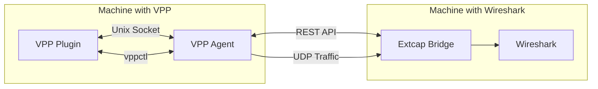

<div style="text-align: center;">
   
</div>

**[VPP to Wireshark Bridge](https://github.com/wapxmas/vpp_wireshark_bridge)** is an innovative tool that connects VPP (Vector Packet Processing) and Wireshark. It allows you to analyze traffic from VPP interfaces in Wireshark in real-time, even if they are installed on different machines.

If you work with high-performance network solutions based on VPP, you know how important it is to be able to see what's happening at the packet level. Now you can use the full power of Wireshark to analyze VPP traffic — without complex tcpdump configurations or virtual interfaces.

## ✨ Key Features

- **Remote traffic capture** — analyze VPP traffic even if Wireshark is installed on another machine
- **Built-in Wireshark integration** — VPP interfaces appear in Wireshark as regular capture devices
- **Flexible direction filtering** — capture incoming (rx), outgoing (tx), or all traffic
- **Minimal performance impact** — optimized for minimal effect on VPP operation
- **UDP and Unix socket support** — choose the optimal transmission method depending on architecture
- **REST API** — programmatically manage capture through a convenient API
- **Windows, Linux, and macOS support** — use Wireshark on any platform

## 🏗️ Solution Architecture

The solution consists of three main components working harmoniously together:



1. **VPP Plugin** — intercepts packets from VPP interfaces and sends them for processing
2. **VPP Agent** — coordinates plugin operation and provides a REST API for management
3. **Python Bridge (extcap)** — receives packets and passes them to Wireshark through the extcap interface

This modular architecture ensures flexibility and efficiency of the solution.

## 📦 How to Install and Configure

The installation consists of three steps:

### 1. Installing the VPP Plugin

```bash
# Copy the plugin to the VPP plugins directory
cp -r vpp_plugin/wireshark_bridge /path/to/vpp/src/plugins/

# Add the plugin to the build list
echo "add_subdirectory(wireshark_bridge)" >> /path/to/vpp/src/plugins/CMakeLists.txt

# Rebuild VPP
cd /path/to/vpp
make build
make install
```

### 2. Configuring the VPP Agent

```bash
# Install dependencies
pip install -r vpp_agent/requirements.txt

# Run the agent
./vpp_agent/vpp_agent.py --host 0.0.0.0 --port 8080 --debug
```

### 3. Wireshark Integration

```bash
# Create a directory for the bridge script
mkdir -p ~/vpp_wireshark_bridge
cp extcap_bridge/vpp_extcap_bridge.py ~/vpp_wireshark_bridge/

# Install dependencies in a virtual environment
cd ~/vpp_wireshark_bridge/
python3 -m venv .env
source .env/bin/activate
pip install -r /path/to/extcap_bridge/requirements.txt
deactivate

# Add the bridge to the Wireshark extcap directory
sudo cp extcap_bridge/vpp_bridge_wrapper.sh /usr/lib/wireshark/extcap/
sudo chmod +x /usr/lib/wireshark/extcap/vpp_bridge_wrapper.sh
```

## 🔧 How to Use

### In Wireshark

1. Launch Wireshark
2. In the interface list, find VPP interfaces (they are marked with the "VPP:" prefix)
3. Select the desired interface and click "Start" to begin capture
4. Enjoy analyzing traffic with the full power of Wireshark tools

### Via Command Line

```bash
# Enable capture for an interface via TCP
vppctl wireshark bridge enable GigabitEthernet0/0/0 192.168.1.100:9000

# Capture only incoming traffic
vppctl wireshark bridge enable GigabitEthernet0/0/0 192.168.1.100:9000 rx

# Disable capture
vppctl wireshark bridge disable GigabitEthernet0/0/0
```

### Via REST API

```bash
# Get a list of interfaces
curl http://vpp-host:8080/interfaces

# Enable traffic capture
curl -X POST -H "Content-Type: application/json" \
  -d '{"interface":"GigabitEthernet0/0/0","bridge_address":"wireshark-host:9000","direction":"both"}' \
  http://vpp-host:8080/enable
```

## 🛠 Useful Tips

1. **Performance**: For minimal impact on VPP performance, use capture mode for only the needed traffic direction (rx/tx).

2. **Filtering**: Use built-in Wireshark filters to analyze specific protocols or packets after capture.

3. **Remote Work**: When working over slow connections, reduce the number of captured packets by activating appropriate filters.

4. **Troubleshooting**: If VPP interfaces do not appear in Wireshark, check:
   - VPP agent network accessibility
   - Correct paths in the wrapper script
   - Firewall settings
   - VPP agent and bridge logs

## 👥 How to Contribute to the Project

Open source is the foundation of the project, and your contribution is highly valued! You can:

1. **Report an issue** — create an issue on GitHub with a detailed description
2. **Suggest an improvement** — initiate a discussion in the issues section
3. **Contribute code** — fork the repository, make changes, and send a pull request
4. **Improve documentation** — documentation is as important as code

All contributions are welcome and will be gratefully reviewed.

## 📈 Development Prospects

In the near future, we plan to:

- Support additional VPP packet metadata
- Integrate with VPP API for deeper analysis
- Optimize performance for high-load systems
- Add advanced filtering capabilities on the VPP side

## 🔚 Conclusion

**VPP to Wireshark Bridge** is a powerful tool that makes developing and debugging VPP-based applications significantly easier and more efficient. It combines the performance of VPP with the analytical capabilities of Wireshark, providing developers the best of both worlds.

Try the project today, leave your feedback, and join the development!

---

<div style="text-align: center; margin-top: 30px;">
<a href="https://github.com/wapxmas/vpp_wireshark_bridge" style="display: inline-block; padding: 10px 20px; background-color: #0366d6; color: white; text-decoration: none; border-radius: 5px; font-weight: bold;">⭐ Star on GitHub ⭐</a>
</div> 