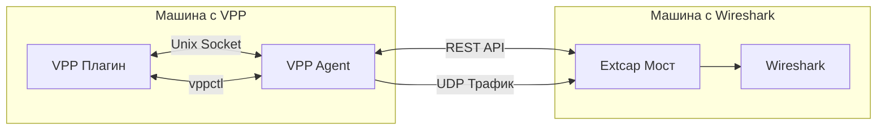

# 🔄 VPP to Wireshark Bridge

<div style="text-align: center;">
  
</div>

## Что это и зачем вам это нужно?

**VPP to Wireshark Bridge** — это инновационный инструмент, связывающий VPP (Vector Packet Processing) и Wireshark. Он позволяет анализировать трафик с интерфейсов VPP в Wireshark в реальном времени, даже если они установлены на разных машинах.

Если вы работаете с высокопроизводительными сетевыми решениями на базе VPP, вы знаете, как важно иметь возможность видеть, что происходит на уровне пакетов. Теперь вы можете использовать всю мощь Wireshark для анализа трафика VPP — без сложных настроек tcpdump или виртуальных интерфейсов.

## ✨ Ключевые особенности

- **Удалённый захват трафика** — анализируйте трафик VPP даже если Wireshark установлен на другой машине
- **Встроенная интеграция с Wireshark** — интерфейсы VPP появляются в Wireshark как обычные устройства захвата
- **Гибкая фильтрация направления** — захватывайте входящий (rx), исходящий (tx) или весь трафик
- **Минимальное влияние на производительность** — оптимизирован для минимального воздействия на работу VPP
- **Поддержка UDP и Unix-сокетов** — выбирайте оптимальный способ передачи в зависимости от архитектуры
- **REST API** — управляйте захватом программно через удобный API
- **Поддержка Windows, Linux и macOS** — используйте Wireshark на любой платформе

## 🏗️ Архитектура решения

Решение состоит из трёх основных компонентов, гармонично работающих вместе:



1. **Плагин VPP** — перехватывает пакеты с интерфейсов VPP и отправляет их на обработку
2. **VPP агент** — координирует работу плагина и предоставляет REST API для управления
3. **Python мост (extcap)** — получает пакеты и передает их в Wireshark через интерфейс extcap

Такая модульная архитектура обеспечивает гибкость и эффективность решения.

## 📦 Как установить и настроить

Установка решения состоит из трёх шагов:

### 1. Установка плагина VPP

```bash
# Скопируйте плагин в директорию плагинов VPP
cp -r vpp_plugin/wireshark_bridge /путь/к/vpp/src/plugins/

# Добавьте плагин в список сборки
echo "add_subdirectory(wireshark_bridge)" >> /путь/к/vpp/src/plugins/CMakeLists.txt

# Пересоберите VPP
cd /путь/к/vpp
make build
make install
```

### 2. Настройка VPP агента

```bash
# Установите зависимости
pip install -r vpp_agent/requirements.txt

# Запустите агент
./vpp_agent/vpp_agent.py --host 0.0.0.0 --port 8080 --debug
```

### 3. Интеграция с Wireshark

```bash
# Создайте каталог для скрипта моста
mkdir -p ~/vpp_wireshark_bridge
cp extcap_bridge/vpp_extcap_bridge.py ~/vpp_wireshark_bridge/

# Установите зависимости в виртуальное окружение
cd ~/vpp_wireshark_bridge/
python3 -m venv .env
source .env/bin/activate
pip install -r /путь/к/extcap_bridge/requirements.txt
deactivate

# Добавьте мост в директорию extcap Wireshark
sudo cp extcap_bridge/vpp_bridge_wrapper.sh /usr/lib/wireshark/extcap/
sudo chmod +x /usr/lib/wireshark/extcap/vpp_bridge_wrapper.sh
```

## 🔧 Как использовать

### В Wireshark

1. Запустите Wireshark
2. В списке интерфейсов найдите интерфейсы VPP (они обозначены префиксом "VPP:")
3. Выберите нужный интерфейс и нажмите "Start" для начала захвата
4. Наслаждайтесь анализом трафика с полной мощью инструментов Wireshark

### Через командную строку

```bash
# Включение захвата для интерфейса через TCP
vppctl wireshark bridge enable GigabitEthernet0/0/0 192.168.1.100:9000

# Захват только входящего трафика
vppctl wireshark bridge enable GigabitEthernet0/0/0 192.168.1.100:9000 rx

# Отключение захвата
vppctl wireshark bridge disable GigabitEthernet0/0/0
```

### Через REST API

```bash
# Получение списка интерфейсов
curl http://vpp-host:8080/interfaces

# Включение захвата трафика
curl -X POST -H "Content-Type: application/json" \
  -d '{"interface":"GigabitEthernet0/0/0","bridge_address":"wireshark-host:9000","direction":"both"}' \
  http://vpp-host:8080/enable
```

## 🛠 Полезные советы

1. **Производительность**: Для минимального воздействия на производительность VPP используйте режим захвата только нужного направления трафика (rx/tx).

2. **Фильтрация**: Используйте встроенные фильтры Wireshark для анализа конкретных протоколов или пакетов после захвата.

3. **Удаленная работа**: При работе через медленные соединения уменьшите количество захватываемых пакетов, активировав соответствующие фильтры.

4. **Отладка проблем**: Если интерфейсы VPP не отображаются в Wireshark, проверьте:
   - Доступность VPP агента по сети
   - Правильность путей в wrapper-скрипте
   - Настройки брандмауэра
   - Журналы VPP агента и моста

## 👥 Как внести свой вклад в проект

Открытый исходный код — это основа проекта, и ваш вклад очень ценен! Вы можете:

1. **Сообщить о проблеме** — создайте issue на GitHub с подробным описанием
2. **Предложить улучшение** — инициируйте обсуждение в разделе issues
3. **Внести код** — сделайте fork репозитория, внесите изменения и отправьте pull request
4. **Улучшить документацию** — документация важна не меньше, чем код

Все вклады приветствуются и будут рассмотрены с благодарностью.

## 📈 Перспективы развития

В ближайшем будущем планируется:

- Поддержка дополнительных метаданных пакетов VPP
- Интеграция с VPP API для более глубокого анализа
- Оптимизация производительности для высоконагруженных систем
- Расширенные возможности фильтрации на стороне VPP

## 🔚 Заключение

**VPP to Wireshark Bridge** — это мощный инструмент, делающий разработку и отладку приложений на базе VPP значительно проще и эффективнее. Он соединяет производительность VPP с аналитическими возможностями Wireshark, предоставляя разработчикам лучшее из обоих миров.

Попробуйте проект сегодня, оставьте свой отзыв и присоединяйтесь к развитию!

---

<div style="text-align: center; margin-top: 30px;">
<a href="https://github.com/wapxmas/vpp_wireshark_bridge" style="display: inline-block; padding: 10px 20px; background-color: #0366d6; color: white; text-decoration: none; border-radius: 5px; font-weight: bold;">⭐ Поставить звезду на GitHub ⭐</a>
</div> 